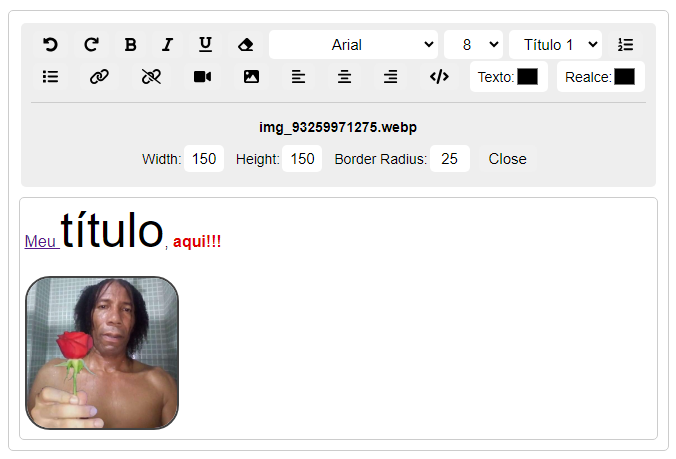

## **Caixa de Texto Formatável**

Este recurso permite a criação de caixas de texto formatáveis e foi desenvolvido utilizando JavaScript para a parte de funcionalidade e CSS para o design.

### **Instruções de Uso**

Para implementar a caixa de texto formatável em seu projeto, siga os passos abaixo:

1. Adicione o seguinte arquivo no `<head>` do seu documento HTML:

```html
<link rel="stylesheet" href="css/style.css">
```

2. Adicione o seguinte arquivo no final do seu documento HTML:

```html
<script src="construct.js"></script>
```

3. Em seguida, insira o seguinte script:

```html
<script>_construct('#form',['video','image']);</script>
```

No script acima, o primeiro parâmetro é o seletor do formulário (classe ou ID), e o segundo parâmetro é um array contendo os elementos que você deseja incluir na caixa de texto. Se não desejar incluir nenhum elemento, deixe o array vazio.

**Exemplo de formulário:**

```html
<form action="enviarDados.php" id="form">
    <input type="text" name="title">
    <button type="submit">Enviar</button>
</form>
```

Para salvar conteúdo multimídia (imagens e vídeos), utilize um loop no PHP para decodificar e salvar os arquivos enviados.

### **Visão da array (conteudo, vídeo e imagem)**

**Imagem:** `$_POST['imageData']`

```json 
{"src": "data:image/webp;base64,UklGRljEA....", "id":"img_2423432.webp"}
```

**Vídeo:** `$_POST['videoData']`

```json 
{"src": "data:video/mp4;base64,UklGsdfaee....", "id":"video_32432422.mp4"}
```

**Conteúdo:** `$_POST['conteudo']`

```json 
{"Meu conteudo em HTML"}
```

### **Exemplo em PHP**

```php
$conteudo = json_decode($_POST['conteudo'], true);
$imageData = json_decode($_POST['imageData'], true);
$videoData = json_decode($_POST['videoData'], true);

file_put_contents('file.html', $conteudo[0]); // Salva caixa de texto

// Salvar imagens
foreach ($imageData as $value) {
    $image_base64 = preg_replace('/^data:image\/(png|jpeg|jpg);base64,/', '', $value['src']);
    $image_binary = base64_decode($image_base64);
    file_put_contents($value['id'], $image_binary);
}

// Salvar vídeos
foreach ($videoData as $value) {
    $video_base64 = preg_replace('/^data:video\/(mp4|webm);base64,/', '', $value['src']);
    $video_binary = base64_decode($video_base64);
    file_put_contents($value['id'], $video_binary);
}
```

Para recuperar o conteúdo da caixa de texto, utilize `json_decode($_POST['conteudo'], true)`. Os outros parâmetros seguem o mesmo princípio.

### **Importante**

Caso esteja usando os ícones do [FONTAWESOME](https://fontawesome.com/), remova o seletor `SVG` do arquivo [style.css](css/style.css).

Este recurso é disponibilizado sob a [Licença MIT](LICENSA).